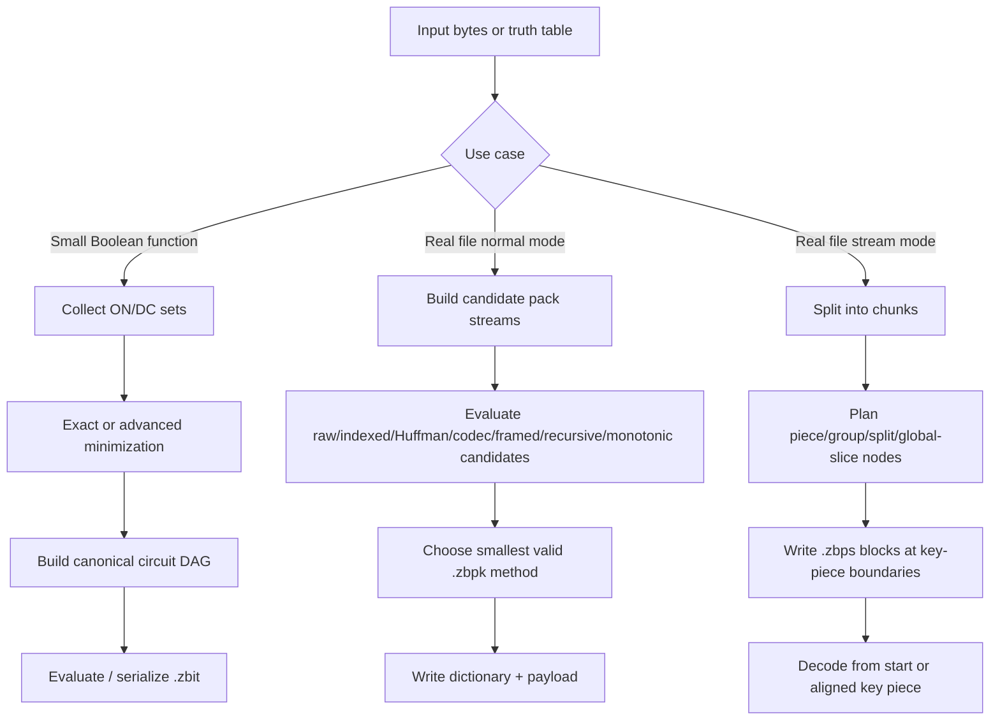
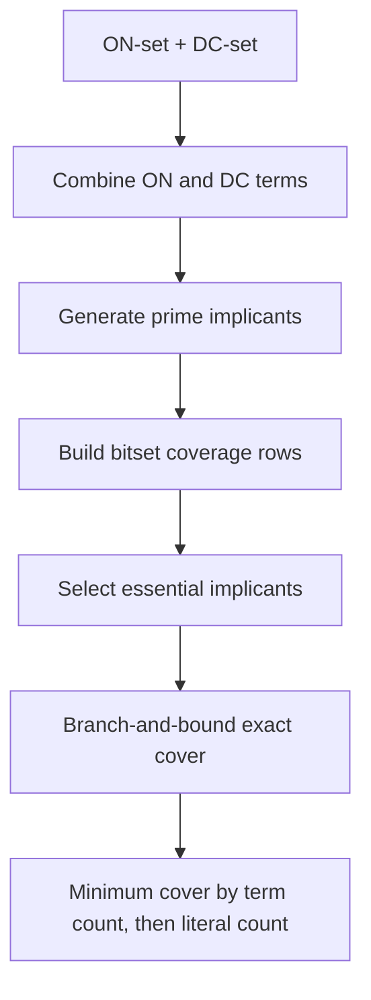
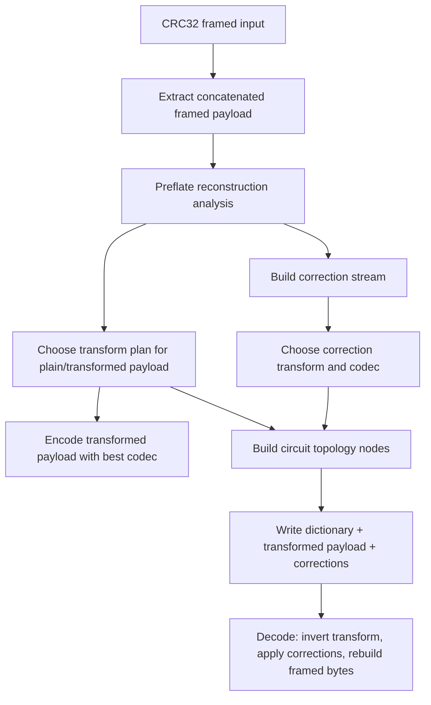

<!-- Licensed under the PolyForm Noncommercial License 1.0.0. See LICENSE. -->
<!-- Copyright (c) 2026 Riccardo Cecchini <rcecchini.ds@gmail.com>. -->

# zBit Algorithm Structure

This document is a working map for humans and coding agents that need to understand, maintain, or extend the `zBit` compression system without getting lost in its current structural complexity.

It connects the research principles in `papers/` with the effective implementation in `zbit-rs/`, especially the idea of treating binary data as a Boolean landscape similar to a Karnaugh map, extracting repeated/simple regions as circuits, simplifying those circuits, and selecting the representation that gives the best reversible compression result.

The most important rule is this:

> zBit is not only a byte compressor and not only a Boolean minimizer. It is an adaptive representation selector. Boolean/circuit modeling is one of its structural tools, and the packer must choose it only when the model plus metadata is smaller than safer alternatives.

---

## 1. The core mental model

### 1.1 A file as a high-dimensional Boolean map

A file can be viewed as a sequence of bytes, but for zBit development it is more useful to also view it as a Boolean function over positions, local contexts, byte bits, and transformation states.

A Karnaugh map is the small visual version of this idea:

- each cell is an input assignment,
- adjacent cells differ by one bit,
- groups of adjacent equal outputs can be represented by a simpler Boolean term,
- bigger legal groups remove more variables and reduce description cost.

For a real file, the same concept becomes high-dimensional and non-visual:

- **cells** are bytes, bits, symbols, chunks, transformed positions, or local truth-table rows;
- **ON-set** is the set of positions/assignments where a modeled output bit is `1`;
- **OFF-set** is the set where the output must remain `0`;
- **don't-care set** is the set where the optimizer may choose either value because the result is unused or can be corrected elsewhere;
- **cube / implicant** is a rectangular generalized region of the Boolean map;
- **circuit** is a compact executable description of one or more such regions;
- **compression** happens when the model, dictionary, references, and residual corrections are smaller than the raw bytes.

In practice, zBit currently applies this principle at several granularities:

1. **Small truth-table models** are minimized into Boolean circuits.
2. **Byte dictionaries** can be encoded with raw symbols, Huffman codes, or circuit blobs, although byte-level circuit blobs are normally gated out because the raw byte dictionary is denser for 8-bit symbols.
3. **Framed data** is decomposed into payload plus reconstructable frame metadata.
4. **Recursive transform paths** model transformed payloads and corrections using reversible circuit-like topology metadata.
5. **Streaming mode** groups chunks into local or global references when the grouped representation wins.

The future “full potential” direction is a true cross-file or cross-region **Circuit Atlas**: a content-addressed dictionary of reusable circuits/slices that can link distant but structurally similar regions. The current implementation already contains some foundations for that direction: payload hashing, range caches, transform topology metadata, stream group nodes, and global-slice references.

---

## 2. Glossary for agents

| Term | Meaning in zBit | Main implementation references |
|---|---|---|
| Boolean map / K-map | Conceptual truth table over a bounded input support. Used to find rectangular/cubic regions that can be simplified. | `papers/zbit-algorithmsResearch.md`; `zbit-rs/src/model.rs::ZbitModel`; `zbit-rs/src/minimizer.rs::Implicant` |
| Minterm | One exact input assignment where output is `1`. | `zbit-rs/src/model.rs::collect_sets_from_table`; `zbit-rs/src/circuit.rs::BitsMap::add_minterm` |
| ON-set | All minterms that must evaluate to `1`. | `zbit-rs/src/model.rs::collect_sets_from_table`; `zbit-rs/src/minimizer.rs::minimize_exact` |
| DC-set / don't-care | Assignments where the minimizer may choose either output to simplify the circuit. | `zbit-rs/src/model.rs::collect_sets_from_table`; `zbit-rs/src/advanced.rs::canonicalize_sets` |
| Cube / implicant | A partial assignment represented by `(value, mask)`. Mask bit `1` means fixed literal; mask bit `0` means free dimension. | `zbit-rs/src/minimizer.rs::Implicant` |
| Prime implicant | A cube that cannot be legally enlarged further without changing required behavior. | `zbit-rs/src/minimizer.rs::generate_prime_implicants` |
| Cover | A set of cubes whose union covers all ON-set minterms. | `zbit-rs/src/minimizer.rs::select_minimum_cover`; `zbit-rs/src/advanced.rs::greedy_cover` |
| Circuit DAG | Interned graph of pins and logic nodes. | `zbit-rs/src/model.rs::NodeType`, `Node`, `ZbitModel::intern_node` |
| Adaptive pack | Real-file container that evaluates multiple candidate encodings and writes the smallest valid one. | `zbit-rs/src/pack/core.rs::compress_adaptive_to_bytes`; `zbit-rs/src/pack_rules.rs::choose_best_method` |
| Recursive circuit path | Frame-aware path that models a deflate/preflate payload, transformed payload, correction payload, codec selection, and topology metadata. | `zbit-rs/src/pack/recursive.rs::build_recursive_circuit_stream`; `zbit-rs/src/pack/transforms.rs::choose_adaptive_transform_plan` |
| Stream key piece | Restartable chunk boundary that allows decoding from a later block without replaying the whole stream. | `zbit-rs/src/pack/stream.rs::compress_stream_to_bytes`; `decompress_stream_file_from_key_piece` |
| Global slice | Stream node that references a range from a shared/global overfit payload instead of storing a local packed block. | `zbit-rs/src/pack/stream.rs::StreamNodeKind::GlobalSlice`; `stream_global_slice_node`; `decode_stream_node` |

---

## 3. End-to-end architecture



There are two different but connected levels:

1. **Model level (`.zbit`)**: Boolean table -> minimized implicants -> canonical gate DAG.
2. **Pack level (`.zbpk` / `.zbps`)**: bytes -> many reversible candidate representations -> smallest valid container.

The model level is the cleanest expression of the Karnaugh-map principle. The pack level is where real compression decisions happen.

---

## 4. Boolean minimization layer

### 4.1 Implicant representation

The basic internal unit is:

```text
Implicant { value: u32, mask: u32 }
```

Implemented in:

- `zbit-rs/src/minimizer.rs::Implicant`
- `Implicant::covers(minterm)`
- `Implicant::literal_count()`

Interpretation:

- `mask` bit = `1`: this input bit is fixed and contributes one literal.
- `mask` bit = `0`: this input bit is free; the cube covers both values along that dimension.
- `value` stores the fixed bit values, masked by `mask`.

Example:

```text
num_inputs = 4
value      = 0b1000
mask       = 0b1011
cube       = x3 & !x1 & !x0, while x2 is free
```

This is exactly the non-visual equivalent of grouping adjacent Karnaugh-map cells.

### 4.2 Exact minimization

Implemented in:

- `zbit-rs/src/minimizer.rs::minimize_exact`
- `generate_prime_implicants`
- `select_minimum_cover`
- `dfs_cover`
- `branch_column`
- `new_gain`

Algorithm structure:



Details:

1. `minimize_exact` merges ON and DC terms, sorts/deduplicates them, generates primes, and selects a cover for the ON-set only.
2. `generate_prime_implicants` repeatedly combines terms with the same mask that differ in exactly one fixed bit. This is the tabular Quine-McCluskey equivalent of growing K-map groups.
3. `select_minimum_cover` converts each candidate implicant into a bitset row over ON-set minterms.
4. Essential implicants are selected first when only one row covers a column.
5. Remaining coverage is solved by `dfs_cover`, using branch-and-bound pruning.
6. The best exact cover is optimized first by number of terms and then by literal count.

Important scope rule:

- Exact minimization is intentionally bounded.
- `zbit-rs/src/model.rs::ZBIT_MAX_INPUTS_EXACT` is `16`.
- `ZbitModel::compress_from_table` enforces this exact limit through `collect_sets_from_table(..., require_exact_bound = true)`.

Do not use exact minimization as a whole-file strategy. It is for small support functions, exact tests, local windows, and truth-table models.

### 4.3 Canonical circuit model

Implemented in:

- `zbit-rs/src/model.rs::ZbitModel`
- `NodeType`
- `Node`
- `NodeKey`
- `ZbitModel::intern_node_raw`
- `ZbitModel::intern_node`
- `ZbitModel::build_from_implicants`
- `ZbitModel::to_bytes`
- `ZbitModel::from_bytes`

The model converts minimized implicants into a canonical logic DAG:

- `Pin`: input variable.
- `Not`: inversion.
- `And`: product term or true constant when empty.
- `Or`: final sum or false constant when empty.
- `Xor`: parity node.

Canonicalization done by `intern_node`:

- validates node arity;
- sorts commutative inputs;
- deduplicates repeated `And`/`Or` inputs;
- cancels repeated `Xor` inputs by parity;
- collapses `Not(Not(x))`;
- propagates true/false constants;
- detects `x & !x = false` and `x | !x = true`;
- returns existing interned nodes through `NodeKey`.

This is essential for compression because structurally equal subcircuits must become the same node. Otherwise the file stores duplicated logic.

### 4.4 Building a circuit from cubes

Implemented in:

- `zbit-rs/src/model.rs::ZbitModel::build_from_implicants`

For each implicant:

1. Iterate fixed mask bits.
2. Use the pin directly when the value bit is `1`.
3. Use `Not(pin)` when the value bit is `0`.
4. Build an `And` node for the product term.
5. Build an `Or` node over all product terms.

The result is a two-level SOP-like circuit, but stored as a canonical DAG so future sharing/rewrite work can reuse identical nodes.

### 4.5 Evaluation and validation

Implemented in:

- `zbit-rs/src/model.rs::ZbitModel::evaluate`
- `ZbitModel::decompress_to_table`
- `ZbitModel::validate_against_table`

Validation rule:

> A circuit is not a compression result until it can reproduce the expected table or bytes exactly.

`validate_against_table` normalizes nonzero expected values to `1` and compares every truth-table row. This must remain strict.

---

## 5. Advanced minimization layer

The paper guidance says exact methods are valuable only inside bounded windows, while larger problems require heuristics, graph-like rewriting, SAT-local checks, and explicit objectives. The implementation follows that principle in `advanced.rs`.

Implemented in:

- `zbit-rs/src/advanced.rs::AdvancedOptions`
- `MappingObjective`
- `ObjectiveEstimate`
- `AdvancedReport`
- `minimize_advanced`

### 5.1 Objective-aware scoring

Implemented in:

- `zbit-rs/src/advanced.rs::evaluate_cover_objective`
- `cube_weight`
- `estimate_better`

Supported objectives:

- `LiteralCount`
- `AsicArea`
- `AsicDelay`
- `FpgaLut4`
- `FpgaLut6`

This is important because the smallest SOP is not always the best mapped circuit. A cover with slightly more literals may have better depth or LUT mapping.

`ObjectiveEstimate` reports:

- implicant count,
- literal count,
- estimated AND2 gates,
- estimated NOTs,
- estimated levels,
- estimated LUT count,
- weighted cost.

### 5.2 Espresso-style heuristic cover flow

Implemented in:

- `zbit-rs/src/advanced.rs::run_espresso_heuristic`
- `cube_only_hits_allowed`
- `greedy_cover`
- `remove_absorbed_terms`

Algorithm concept:

1. Start from exact minterm cubes: one fully specified cube for each ON-set minterm.
2. Try to expand each cube by clearing mask bits, as long as the expanded cube covers only ON+DC assignments.
3. Create a pool of old and expanded cubes.
4. Optionally add consensus merges.
5. Deduplicate and remove absorbed terms.
6. Select a cover greedily using gain divided by objective weight.
7. Repeat for `espresso_rounds` and keep the best objective score.

This is a simplified Espresso-like flow. It implements the spirit of EXPAND and IRREDUNDANT cleanup, but it should not be confused with a full industrial Espresso implementation with all reduce/essential variants.

### 5.3 Consensus/AIG-like local rewriting

Implemented in:

- `zbit-rs/src/advanced.rs::generate_consensus_merges`
- `run_rewrite_flows`

The merge rule is the same core idea as K-map adjacency:

```text
same mask + values differ in exactly one fixed bit -> remove that bit from mask
```

Before accepting the merged cube, `cube_only_hits_allowed` verifies that every minterm now covered by the larger cube belongs to ON+DC. This prevents illegal OFF-set coverage.

This is currently cover-level rewriting, not a full AIG/XAG network optimizer. It is still valuable because it can find larger legal cubes after earlier heuristic steps.

### 5.4 Resubstitution / absorption cleanup

Implemented in:

- `zbit-rs/src/advanced.rs::remove_absorbed_terms`
- `cube_covers_cube`

If cube `A` covers every assignment of cube `B`, then `B` is redundant and can be removed. This is a direct cover-level version of eliminating dominated expressions.

Rule:

```text
A absorbs B when A is more general and all assignments of B are inside A.
```

### 5.5 SAT-assisted local exactness

Implemented in:

- `zbit-rs/src/sat.rs::Cnf`
- `Cnf::new`
- `Cnf::push_clause`
- `is_satisfiable`
- internal DPLL helpers: `unit_propagate`, `dpll`
- `zbit-rs/src/advanced.rs::sat_term_is_redundant`
- `sat_prune_redundant_terms`

Purpose:

- Convert a local redundancy question into CNF.
- Ask whether there exists an assignment that is covered by the target cube, not covered by any other cube, and not only a don't-care.
- If no such assignment exists, the term is redundant and can be removed.

Bound:

- Controlled by `AdvancedOptions::sat_local_exact_inputs`.
- Default is `12`.

This matches the paper principle: SAT is not the whole compressor; it is a bounded local oracle inside a larger heuristic flow.

### 5.6 Exact seed versus heuristic result

Implemented in:

- `zbit-rs/src/advanced.rs::minimize_advanced`

Flow:

1. Canonicalize ON/DC sets.
2. Run heuristic cover minimization.
3. Run rewrite/SAT cleanup.
4. If `num_inputs <= exact_seed_max_inputs`, also run exact minimization and rewrite/SAT cleanup.
5. Compare exact-seed result and heuristic result using objective-aware scoring.
6. Return the chosen cover and report.

This is the current bridge between exact minimization and practical heuristic optimization.

---

## 6. Real-file adaptive packing layer

The file compressor is implemented in `zbit-rs/src/pack/`. It is intentionally adaptive: it computes multiple candidate encodings, compares their full serialized sizes, and writes the smallest valid one.

Entry points:

- `zbit-rs/src/pack/core.rs::compress_adaptive_to_bytes`
- `zbit-rs/src/pack/core.rs::compress_adaptive_to_file`
- `zbit-rs/src/pack/core.rs::decompress_pack_bytes`
- `zbit-rs/src/pack/core.rs::decompress_file`
- Public exports in `zbit-rs/src/lib.rs`

### 6.1 Pack methods

Implemented in:

- `zbit-rs/src/pack_rules.rs::PackMethod`
- `PackMethod::as_u8`
- `PackMethod::from_u8`
- `PackMethod::name`

Current methods:

| Method | Meaning | Main implementation references |
|---|---|---|
| `raw-copy` | Store bytes directly. Baseline fallback. | `write_pack_bytes`; `decompress_pack_bytes` |
| `indexed-raw` | Store unique byte dictionary plus fixed-width symbol index payload. | `build_index_stream`; `pack_symbol_index`; `unpack_symbol_index` |
| `indexed-circuit` | Store each dictionary symbol as a serialized Boolean model blob. | `model_blob_for_symbol`; `build_circuit_blobs`; `decode_circuit_dictionary` |
| `indexed-huffman` | Canonical Huffman coding over byte symbols. | `compute_huffman_lengths`; `build_canonical_codes`; `build_huffman_stream`; `decode_huffman_payload` |
| `raw-deflate` | zlib/deflate candidate over raw input. | `pack/codecs.rs::build_raw_deflate_payload`; `decode_raw_deflate_payload` |
| `raw-zstd` | zstd candidate over raw input. | `build_raw_zstd_payload`; `decode_raw_zstd_payload` |
| `raw-xz` | XZ/LZMA2 candidate with tuned profile search. | `build_raw_xz_payload`; `choose_best_tuned_xz_candidate` |
| `framed-raw` | Store reconstructable CRC32-framed payload without repeated frame overhead. | `pack/recursive.rs::build_framed_payload_run`; `decode_framed_payload` |
| `recursive-circuit-xz` | Transform deflate/preflate payload and correction streams with topology metadata and codec search. | `build_recursive_circuit_stream`; `choose_adaptive_transform_plan`; `decode_recursive_circuit_payload` |
| `monotonic-delta` | Specialized model for monotonic fixed-width integer streams. | `build_monotonic_delta_stream`; `decode_monotonic_delta_payload` |

### 6.2 Candidate selection rule

Implemented in:

- `zbit-rs/src/pack_rules.rs::PackEvaluation`
- `should_evaluate_circuit`
- `choose_best_method`

Important invariant:

> The chosen method should never be worse than the raw-copy baseline unless explicitly allowed by a future experimental mode.

`choose_best_method` starts from raw-copy, then selects smaller candidates. It gives `indexed-circuit` an additional threshold requirement: the circuit candidate must beat the current best by at least about 1% because circuit dictionaries have structural overhead.

Current caveat:

- `should_evaluate_circuit` rejects circuit dictionaries when `symbol_bits <= 8` because a raw byte dictionary is usually denser than per-symbol circuit descriptors.
- In `compress_adaptive_to_bytes`, `eval.symbol_bits` is currently set to `8`, so `indexed-circuit` exists as a feature but is normally skipped for ordinary byte-symbol packing.
- This is correct for the current implementation, but future multi-byte symbols, bit-plane slices, or reusable atlas entries could make circuit dictionaries valuable again.

### 6.3 Index stream and byte dictionary

Implemented in:

- `zbit-rs/src/pack/core.rs::IndexStream`
- `build_index_stream`
- `bits_needed_for_count`
- `pack_symbol_index`
- `unpack_symbol_index`

The packer scans the input, creates a sorted unique symbol list, assigns compact IDs, and writes fixed-width IDs into a bit-packed payload.

Compression benefit appears when:

```text
header + dictionary + bitpacked IDs < raw bytes
```

This is a simple but important general dictionary baseline.

### 6.4 Huffman stream

Implemented in:

- `zbit-rs/src/pack/core.rs::HuffmanStream`
- `HuffmanNode`
- `compute_huffman_lengths`
- `build_canonical_codes`
- `build_huffman_stream`
- `decode_huffman_dictionary`
- `decode_huffman_payload`

The implementation stores a canonical Huffman dictionary as `(symbol, code_length)` pairs. The exact bit codes are reconstructed deterministically during decode.

### 6.5 Circuit dictionary for symbols

Implemented in:

- `zbit-rs/src/pack/core.rs::model_blob_for_symbol`
- `decode_symbol_from_blob`
- `build_circuit_blobs`
- `decode_circuit_dictionary`

For one byte symbol, the code builds an 8-row truth table over 3 input bits. Each row outputs one bit of the symbol. That table is minimized by `ZbitModel::compress_from_table` and serialized as a `.zbit` blob.

Conceptually:

```text
input row index: 0..7
output: bit_i(symbol)
```

This demonstrates the circuit-as-symbol idea. It is not currently the best representation for 8-bit byte dictionaries, but it is a useful prototype for larger symbol widths and future reusable circuit atlas entries.

### 6.6 Raw codec candidates and tuned XZ

Implemented in:

- `zbit-rs/src/pack/codecs.rs::build_raw_deflate_payload`
- `build_raw_zstd_payload`
- `build_raw_xz_payload`
- `choose_best_tuned_xz_candidate`
- `tuned_xz_param_matrix`
- `tuned_xz_budget`
- `choose_best_codec`
- `decode_with_codec`

Profiles are controlled through:

- `ZBIT_COMPRESSION_PROFILE`
- `ZBIT_PROFILE`

Implemented profile enum:

- `CompressionProfile::Fast`
- `Balanced`
- `Deep`
- `Research`

These profiles change search budgets and whether XZ extreme refinements are attempted.

### 6.7 Framed-run extraction

Implemented in:

- `zbit-rs/src/pack/recursive.rs::parse_crc32_frame_at`
- `build_framed_payload_run`
- `framed_dictionary_size`
- `write_framed_dictionary`
- `decode_framed_payload`

This detects generic CRC32-framed byte runs:

```text
[length: u32 big-endian][tag: 4 bytes][payload][crc32(tag + payload)]
```

The compressor stores:

- prefix before the framed run,
- suffix after the framed run,
- common frame tag,
- chunk length metadata,
- concatenated frame payload.

The decoder reconstructs frame headers and CRCs exactly. This is not PNG-specific anymore; it is generic CRC32 frame modeling.

### 6.8 Recursive circuit transform path

Implemented in:

- `zbit-rs/src/pack/recursive.rs::build_recursive_circuit_stream`
- `recursive_circuit_dictionary_size`
- `write_recursive_circuit_dictionary`
- `decode_recursive_circuit_payload`
- `zbit-rs/src/pack/transforms.rs::choose_adaptive_transform_plan`
- `apply_transform_plan`
- `invert_transform_plan`
- `build_topology_for_plan`
- `embed_correction_plan_in_topology`
- `decode_embedded_correction_plan`

This is the most advanced real-file path. It is called “recursive-circuit-xz” because it stores a structural transform plan and a reconstructable topology, not just a flat compressed byte stream.

The flow is:



Transform families implemented in `transforms.rs` include:

- identity,
- previous-byte delta,
- previous-byte XOR,
- bit-plane transpose,
- bit-plane transpose + delta/XOR,
- periodic head/tail splitting,
- periodic gather,
- periodic delta,
- periodic XOR,
- tail gather/delta/XOR variants.

The topology metadata is stored as `CircuitTopologyNode`:

- `id`,
- `parent_id`,
- `relation`,
- `order`,
- `kind`,
- `param_a`,
- `param_b`,
- `hash64`.

This is a current practical version of “circuits as reusable structure.” Future atlas work should extend this from local transform topology into cross-region, content-addressed circuit reuse.

### 6.9 Monotonic delta path

Implemented in:

- `zbit-rs/src/pack/core.rs::MonotonicDeltaStream`
- `MonotonicDeltaMode`
- `zbit-rs/src/pack/codecs.rs::build_monotonic_delta_stream`
- `decode_monotonic_delta_payload`

This path targets fixed-width monotonic integer streams. It stores:

- integer width,
- count,
- first value,
- gap coding mode,
- optional trailing-zero shift,
- codec and payload.

It is an example of a domain-specific model that can beat generic compression when the file has a strong latent structure.

### 6.10 Caches and candidate telemetry

Implemented in:

- `zbit-rs/src/pack/core.rs::PayloadHash`
- `CodecProfileKey`
- `StreamRangeCacheKey`
- `CompressionCache`
- `CompressionContext`
- `CacheStats`
- `CandidateTimingStats`

The current cache foundations are important for future nonlocal circuit linking:

- `PayloadHash` combines `xxh3_64`, a BLAKE3-derived 128-bit digest, and length.
- `CompressionCache` stores codec outputs, preflate outputs, and stream range candidates.
- `CacheStats` reports hit/miss telemetry.

These should become the seed of any future content-addressed Circuit Atlas.

---

## 7. Stream mode structure

Stream mode is implemented in:

- `zbit-rs/src/pack/stream.rs::compress_stream_to_bytes`
- `compress_adaptive_stream_to_file`
- `decompress_stream_from_bytes`
- `decompress_stream_file`
- `decompress_stream_file_from_key_piece`
- `StreamPackOptions`
- `StreamPackStats`

### 7.1 Stream options

Implemented in:

- `zbit-rs/src/pack/core.rs::StreamPackOptions`
- `validate_stream_options`

Fields:

- `chunk_size`
- `key_piece_interval`
- `max_group_depth`
- `max_group_pieces`
- `carry_grouping_history`
- `realtime_mode`
- `wide_overfitting_circuits`

Default behavior:

- chunk size: `256 KiB`,
- key piece interval: `8`,
- grouping depth: `2`,
- group pieces: `8`,
- carry grouping history: enabled,
- realtime mode: enabled,
- wide overfitting circuits: enabled.

### 7.2 Stream nodes

Implemented in:

- `zbit-rs/src/pack/core.rs::StreamNodeKind`
- `StreamNode`
- `zbit-rs/src/pack/stream.rs::stream_piece_node`
- `stream_group_node`
- `stream_split_node`
- `stream_global_slice_node`
- `write_stream_node`
- `decode_stream_node`

Node kinds:

| Node kind | Meaning |
|---|---|
| `Piece` | One chunk packed independently. |
| `Group` | Several adjacent chunks packed as one range. |
| `Split` | Binary tree combining two child nodes. |
| `GlobalSlice` | Reference to a byte range inside a shared/global decoded payload. |

This structure lets stream mode compare local independence against grouped compression. It also gives a future place to insert cross-region circuit references.

### 7.3 Stream planning

Implemented in:

- `zbit-rs/src/pack/stream.rs::build_best_stream_node`
- `stream_pack_range_candidate`
- `compress_stream_range_pack_bytes`

For each block:

1. Split into chunks.
2. Recursively build candidate nodes.
3. Try split candidates.
4. Try group candidates when allowed by depth and piece limits.
5. Choose the node with the smallest encoded size.
6. Memoize local `(start, end, depth)` decisions.
7. Cache absolute range candidates using `StreamRangeCacheKey`.

### 7.4 Key-piece restartability

Implemented in:

- `zbit-rs/src/pack/stream.rs::compress_stream_to_bytes`
- `decompress_stream_from_bytes`
- `decompress_stream_file_from_key_piece`

A receiver can start decoding only from chunk indices that are multiples of `key_piece_interval`. `decompress_stream_from_bytes` validates this alignment before decoding.

This is essential for real-time workflows because the decoder does not need all previous history to recover a later block.

### 7.5 Wide overfit and shared grouping payloads

Implemented in:

- `compress_stream_wide_overfit_pack_bytes`
- `compress_stream_realtime_pack_bytes`
- global/shared payload logic in `compress_stream_to_bytes`
- `StreamNodeKind::GlobalSlice`

Modes:

- **Wide overfit**: compress the whole stream input globally and allow blocks to reference slices.
- **Shared grouping payload**: in non-wide realtime mode, optionally store one global payload and let local blocks choose between local packing and global slices.

This is the closest implemented mechanism to “linking circuits from totally different parts of the file.” It currently links byte ranges through global decoded slices, not generalized Boolean circuits. Future atlas work should extend this into reusable symbolic/circuit fragments.

---

## 8. Binary formats and strict parsing

### 8.1 `.zbit` model format

Implemented in:

- `zbit-rs/src/model.rs::to_bytes`
- `ZbitModel::from_bytes`
- `save_to_path`
- `load_from_path`

Magic/version:

- `ZBIT_MAGIC = 0x5A42_4954`
- `ZBIT_VERSION = 1`

Parser invariants:

- supported version only,
- valid node type,
- valid arity,
- node arguments must reference earlier nodes,
- root must exist,
- canonical duplicate nodes are rejected,
- all required pin nodes must exist,
- trailing bytes are rejected.

### 8.2 `.zbpk` pack format

Implemented in:

- `zbit-rs/src/pack/core.rs::write_pack_bytes`
- `decompress_pack_bytes`
- binary helpers in `zbit-rs/src/pack/format.rs`

Magic/version:

- `ZBPK_MAGIC = 0x5A42_504B`
- `ZBPK_VERSION = 2`

Header stores:

- method,
- bits per symbol,
- unique count,
- original size,
- dictionary size,
- payload size.

`decompress_pack_bytes` performs method-specific validation before decoding. It also enforces `ZBPK_MAX_OUTPUT_BYTES` to avoid unbounded decode expansion.

### 8.3 `.zbps` stream format

Implemented in:

- `zbit-rs/src/pack/stream.rs::compress_stream_to_bytes`
- `parse_stream_header`
- `decompress_stream_from_bytes`

Magic/version:

- `ZBPS_MAGIC = 0x5A42_5053`
- `ZBPS_VERSION = 1`

Flags:

- `ZBPS_FLAG_CARRY_GROUPING_HISTORY`
- `ZBPS_FLAG_WIDE_OVERFITTING_CIRCUITS`
- `ZBPS_FLAG_SHARED_GROUPING_PAYLOAD`

Parser invariants:

- supported flags only,
- nonzero chunk size/key interval/group pieces,
- expected chunk count must match original size,
- expected block count must match key interval,
- block order must be deterministic,
- block decoded length/chunk count must match headers,
- key-piece start must align to interval,
- trailing bytes are rejected.

---

## 9. Legacy/secondary circuit module

There is also an older gate-level module:

- `zbit-rs/src/circuit.rs::GateType`
- `Gate`
- `BitsMap`
- `BitsMap::set`
- `BitsMap::add_minterm`
- `BitsMap::quine_mccluskey_optimize`
- `BitsMap::final_compression`
- `BitsMap::verify_logic`
- `zbit-rs/src/file_format.rs::save_circuit`
- `load_circuit`

This module expresses the same high-level idea with `Rc<RefCell<Gate>>` references and manual hashing. The active library exports and tests are centered on `model.rs`, `minimizer.rs`, `advanced.rs`, and `pack/`.

For new work, prefer the active canonical `ZbitModel` path unless there is a deliberate reason to revive or migrate legacy `BitsMap` behavior.

---

## 10. Implementation reference map

### 10.1 Theory and guidance

| Concern | Source |
|---|---|
| K-map intuition and scalability limits | `papers/zbit-algorithmsResearch.md` |
| Quine-McCluskey exact minimization | `papers/zbit-algorithmsResearch.md`; `zbit-rs/src/minimizer.rs` |
| Espresso-style heuristic principles | `papers/zbit-algorithmsResearch.md`; `zbit-rs/src/advanced.rs` |
| SAT as bounded local oracle | `papers/zbit-algorithmsResearch.md`; `zbit-rs/src/sat.rs`; `zbit-rs/src/advanced.rs` |
| Graph/network representation guidance | `papers/zbit-algorithmsResearch.md`; current approximations in `model.rs`, `advanced.rs`, `pack/transforms.rs` |
| Future nonlocal circuit/cache direction | `ROADMAP.md`; cache foundations in `pack/core.rs` and stream global-slice logic |

### 10.2 Boolean model and minimization

| Feature | File | Types/functions |
|---|---|---|
| Implicant/cube representation | `zbit-rs/src/minimizer.rs` | `Implicant`, `covers`, `literal_count` |
| Prime generation | `zbit-rs/src/minimizer.rs` | `generate_prime_implicants` |
| Exact cover selection | `zbit-rs/src/minimizer.rs` | `select_minimum_cover`, `dfs_cover`, `CoverBest` |
| Exact minimization entry | `zbit-rs/src/minimizer.rs` | `minimize_exact` |
| Canonical DAG model | `zbit-rs/src/model.rs` | `ZbitModel`, `Node`, `NodeType`, `NodeKey` |
| Node interning/canonical rules | `zbit-rs/src/model.rs` | `intern_node`, `intern_node_raw`, `true_id`, `false_id` |
| Truth-table to ON/DC sets | `zbit-rs/src/model.rs` | `collect_sets_from_table` |
| Exact model compression | `zbit-rs/src/model.rs` | `compress_from_table` |
| Advanced model compression | `zbit-rs/src/model.rs` | `compress_from_table_advanced`, `compress_from_table_with_objective` |
| Model validation | `zbit-rs/src/model.rs` | `evaluate`, `decompress_to_table`, `validate_against_table` |
| Model serialization | `zbit-rs/src/model.rs` | `to_bytes`, `from_bytes`, `save_to_path`, `load_from_path` |

### 10.3 Advanced heuristic and SAT flow

| Feature | File | Types/functions |
|---|---|---|
| Options/reporting | `zbit-rs/src/advanced.rs` | `AdvancedOptions`, `AdvancedReport`, `AdvancedMinimization` |
| Objective mapping | `zbit-rs/src/advanced.rs` | `MappingObjective`, `ObjectiveEstimate`, `evaluate_cover_objective` |
| Espresso-like expansion | `zbit-rs/src/advanced.rs` | `run_espresso_heuristic`, `cube_only_hits_allowed` |
| Greedy cover | `zbit-rs/src/advanced.rs` | `greedy_cover`, `cube_weight` |
| Absorption/resubstitution | `zbit-rs/src/advanced.rs` | `remove_absorbed_terms`, `cube_covers_cube` |
| Consensus merges | `zbit-rs/src/advanced.rs` | `generate_consensus_merges` |
| SAT redundancy pruning | `zbit-rs/src/advanced.rs` | `sat_term_is_redundant`, `sat_prune_redundant_terms` |
| Local DPLL SAT solver | `zbit-rs/src/sat.rs` | `Cnf`, `is_satisfiable`, `unit_propagate`, `dpll` |
| Advanced entry point | `zbit-rs/src/advanced.rs` | `minimize_advanced` |

### 10.4 Pack and real-file compression

| Feature | File | Types/functions |
|---|---|---|
| Pack methods | `zbit-rs/src/pack_rules.rs` | `PackMethod`, `PackEvaluation` |
| Selection rules | `zbit-rs/src/pack_rules.rs` | `should_evaluate_circuit`, `choose_best_method` |
| Pack statistics | `zbit-rs/src/pack/core.rs` | `PackStats`, `CandidateTimingStats`, `CacheStats` |
| Compression context/cache | `zbit-rs/src/pack/core.rs` | `PayloadHash`, `CompressionCache`, `CompressionContext` |
| Fixed-width index stream | `zbit-rs/src/pack/core.rs` | `IndexStream`, `build_index_stream`, `pack_symbol_index` |
| Huffman candidate | `zbit-rs/src/pack/core.rs` | `HuffmanStream`, `compute_huffman_lengths`, `build_huffman_stream` |
| Circuit symbol blobs | `zbit-rs/src/pack/core.rs` | `model_blob_for_symbol`, `build_circuit_blobs`, `decode_circuit_dictionary` |
| Pack writer | `zbit-rs/src/pack/core.rs` | `write_pack_bytes` |
| Normal compression entry | `zbit-rs/src/pack/core.rs` | `compress_adaptive_to_bytes`, `compress_adaptive_to_file` |
| Normal decompression entry | `zbit-rs/src/pack/core.rs` | `decompress_pack_bytes`, `decompress_file` |
| Binary helpers | `zbit-rs/src/pack/format.rs` | `push_u16`, `push_u32`, `push_u64`, `read_u8`, `read_varint_u64` |
| Raw codecs | `zbit-rs/src/pack/codecs.rs` | `build_raw_deflate_payload`, `build_raw_zstd_payload`, `build_raw_xz_payload` |
| Tuned XZ search | `zbit-rs/src/pack/codecs.rs` | `tuned_xz_param_matrix`, `build_tuned_xz_candidates`, `choose_best_tuned_xz_candidate` |
| Generic codec choice | `zbit-rs/src/pack/codecs.rs` | `choose_best_codec`, `decode_with_codec` |
| Monotonic streams | `zbit-rs/src/pack/codecs.rs` | `build_monotonic_delta_stream`, `decode_monotonic_delta_payload` |
| Framed payload extraction | `zbit-rs/src/pack/recursive.rs` | `parse_crc32_frame_at`, `build_framed_payload_run`, `decode_framed_payload` |
| Recursive circuit stream | `zbit-rs/src/pack/recursive.rs` | `build_recursive_circuit_stream`, `write_recursive_circuit_dictionary`, `decode_recursive_circuit_payload` |
| Reversible transforms | `zbit-rs/src/pack/transforms.rs` | `apply_transform_plan`, `invert_transform_plan`, `choose_adaptive_transform_plan` |
| Transform topology | `zbit-rs/src/pack/transforms.rs`; `pack/core.rs` | `CircuitTransformPlan`, `CircuitTopologyNode`, `build_topology_for_plan` |

### 10.5 Stream compression

| Feature | File | Types/functions |
|---|---|---|
| Stream options/stats | `zbit-rs/src/pack/core.rs` | `StreamPackOptions`, `StreamPackStats` |
| Stream node types | `zbit-rs/src/pack/core.rs` | `StreamNodeKind`, `StreamNode`, `StreamDecodedNode` |
| Stream validation helpers | `zbit-rs/src/pack/core.rs` | `validate_stream_options`, `expected_chunk_count`, `split_stream_chunks` |
| Realtime per-range compression | `zbit-rs/src/pack/stream.rs` | `compress_stream_realtime_pack_bytes`, `compress_stream_range_pack_bytes` |
| Wide overfit compression | `zbit-rs/src/pack/stream.rs` | `compress_stream_wide_overfit_pack_bytes` |
| Range candidate cache | `zbit-rs/src/pack/stream.rs` | `stream_pack_range_candidate` |
| Stream planning DP | `zbit-rs/src/pack/stream.rs` | `build_best_stream_node` |
| Stream node serialization | `zbit-rs/src/pack/stream.rs` | `write_stream_node`, `decode_stream_node` |
| Stream header parsing | `zbit-rs/src/pack/stream.rs` | `parse_stream_header` |
| Stream compression entry | `zbit-rs/src/pack/stream.rs` | `compress_stream_to_bytes`, `compress_adaptive_stream_to_file` |
| Stream decompression entry | `zbit-rs/src/pack/stream.rs` | `decompress_stream_from_bytes`, `decompress_stream_file`, `decompress_stream_file_from_key_piece` |

### 10.6 Tests and benchmarks

| Concern | File |
|---|---|
| Advanced minimization validation | `zbit-rs/tests/advanced_validation.rs` |
| Model validation | `zbit-rs/tests/model_validation.rs` |
| Pack roundtrips and specialized candidates | `zbit-rs/src/pack/tests.rs` |
| Real-file benchmark validation | `zbit-rs/tests/real_file_benchmark.rs` |
| Stream validation and key-piece resume | `zbit-rs/tests/stream_real_file_benchmark.rs` |
| Cat benchmark scripts/tests | `zbit-rs/scripts/benchmark_cat_challenge*.sh`; `zbit-rs/tests/cat_challenge*_benchmark.rs` |
| Normal benchmark binary | `zbit-rs/src/bin/benchmark_real_file.rs` |
| Stream benchmark binary | `zbit-rs/src/bin/benchmark_stream_real_file.rs` |

---

## 11. Current limitations to keep clear

This section is intentionally blunt so future agents do not overestimate what already exists.

### 11.1 The project does not yet implement a full file-wide Karnaugh map

The current Boolean minimizer works on bounded truth tables. The real-file compressor mostly chooses between byte-level dictionaries, external codecs, frame modeling, recursive transforms, and stream range grouping.

A true file-wide Boolean/K-map atlas would need:

- larger symbol supports,
- bit-plane or context-window truth tables,
- reusable circuit fragments across distant file regions,
- content-addressed circuit identity,
- reference encoding for circuit reuse,
- correction streams for approximate/generalized matches.

The current code has foundations but not the full atlas.

### 11.2 `indexed-circuit` exists but is normally skipped for 8-bit symbols

The code can build a `.zbit` model blob for each byte symbol, but `should_evaluate_circuit` rejects `symbol_bits <= 8`. This is intentional because a raw byte dictionary is typically smaller than one serialized circuit per byte.

Future development should revisit this only when symbols are wider, shared across many locations, or referenced through a global circuit atlas.

### 11.3 Advanced rewriting is cover-level, not full network synthesis

`advanced.rs` has consensus merges, absorption, SAT pruning, balancing-aware scoring, and objectives. It does not yet implement a full AIG/XAG cut-rewrite engine with structural hashing across a large multi-level network.

The paper guidance points toward that future direction.

### 11.4 Stream global slices are byte-range references, not generalized circuits

`GlobalSlice` can reference a region from a shared decoded global payload. This gives strong practical compression for some streaming modes, but it is not yet semantic circuit reuse.

A future atlas should allow:

- references to canonical transform/circuit nodes,
- nonlocal reuse of equivalent subgraphs,
- residual correction for near-equivalent regions,
- restart-safe references within stream blocks.

---

## 12. Development rules for future algorithm work

### 12.1 Preserve roundtrip before optimizing ratio

Every new candidate must have a strict decode path and validation. For pack methods, always compare decoded output with original bytes in tests or benchmark flows before trusting a candidate.

Relevant functions:

- `decompress_pack_bytes`
- `decompress_stream_from_bytes`
- `ZbitModel::validate_against_table`

### 12.2 Never let a heuristic cover the OFF-set

Any cube expansion or merge must prove it covers only ON+DC assignments. The current guard is:

- `advanced.rs::cube_only_hits_allowed`

Future faster implementations may replace enumeration with bitsets/SAT, but the invariant must stay.

### 12.3 Keep exact methods bounded

Do not raise `ZBIT_MAX_INPUTS_EXACT` casually. Exact Q-M and cover search can explode. Prefer local windows, cached cut libraries, or SAT-based local exactness.

### 12.4 Make objective functions explicit

When adding algorithms, record whether the objective is:

- byte size,
- literal count,
- gate count,
- LUT count,
- decode speed,
- compression speed,
- restartability,
- memory use.

Do not mix these silently. `MappingObjective` and `PackEvaluation` are the current examples of explicit scoring.

### 12.5 Separate model cost from payload cost

A circuit is only useful if this is smaller:

```text
circuit metadata + references + corrections < raw bytes or best competing codec
```

Never compare only the circuit expression size. Container overhead matters.

### 12.6 Prefer deterministic selection

Candidate order should be deterministic. When two candidates tie in size, preserve a stable rank or explicit tie rule. This makes benchmark regressions meaningful.

Existing examples:

- `choose_best_tuned_xz_candidate` keeps candidate rank as a tie breaker.
- `choose_adaptive_transform_plan` keeps rank and payload length.
- `choose_best_method` has explicit candidate order.

### 12.7 Cache by content and context

Future nonlocal linking depends on stable identity. Any expensive operation over a byte range, transform payload, or circuit should be keyed by:

- strong payload hash,
- length,
- absolute or logical range when needed,
- profile/options that affect output.

Existing examples:

- `PayloadHash`
- `StreamRangeCacheKey`
- `CodecProfileKey`
- `CompressionCache`

---

## 13. Future direction: Circuit Atlas

The natural next major architecture is a Circuit Atlas.

### 13.1 What the atlas should store

A future atlas should store reusable entries such as:

```text
AtlasEntry {
    content_hash,
    normalized_topology_hash,
    symbol_width,
    input_support,
    transform_plan,
    circuit_model_or_topology,
    decoded_len,
    encoded_cost,
    correction_model,
    references,
}
```

Potential implementation anchors:

- `PayloadHash` for content identity.
- `CircuitTopologyNode::hash64` for structural identity.
- `ZbitModel::to_bytes` for Boolean model storage.
- `StreamRangeCacheKey` for range-aware reuse.
- `StreamNodeKind::GlobalSlice` as the first reference-like stream mechanism.

### 13.2 Atlas candidate selection

A candidate atlas reference should be accepted only when:

```text
reference cost + optional correction cost < local pack cost
```

The atlas should not be a separate “magic” compressor. It should be another candidate source integrated into `PackEvaluation` / stream planning.

### 13.3 Cross-region simplification

The desired future feature is to link similar regions from totally different parts of a file:

1. detect similar payload ranges or transformed ranges,
2. normalize them into a shared topology/circuit,
3. store one base circuit,
4. store cheap references for exact matches,
5. store correction streams for near matches,
6. ensure stream references are restart-safe.

This extends the Karnaugh-map idea beyond local adjacency: regions can be “adjacent” by structure even when they are far apart in file offset.

---

## 14. Suggested agent workflow

When an agent needs to modify the compressor, follow this order:

1. Read this file first.
2. Read `ROADMAP.md` for intended future direction.
3. Read `papers/zbit-algorithmsResearch.md` for algorithmic principles.
4. For Boolean minimization work, inspect `minimizer.rs`, `advanced.rs`, `sat.rs`, and `model.rs`.
5. For normal file compression work, inspect `pack/core.rs`, `pack_rules.rs`, `pack/codecs.rs`, `pack/transforms.rs`, and `pack/recursive.rs`.
6. For streaming work, inspect `pack/stream.rs` plus the stream benchmark binary.
7. Add or update tests before trusting any ratio improvement.
8. Refresh benchmark reports only after validation passes.

Minimum validation commands from repository root:

```bash
cargo test --manifest-path zbit-rs/Cargo.toml
cargo run --manifest-path zbit-rs/Cargo.toml --bin zbit-benchmark -- \
  papers/zbit-algorithmsResearch.md \
  zbit-rs/benchmark_algorithmsResearch.zbpk \
  zbit-rs/benchmark_latest.txt
```

For stream changes, also run the stream benchmark path relevant to the edited code.

---

## 15. One-sentence architecture summary

zBit compresses by searching for cheaper reversible representations of data: small truth tables become minimized circuits, real files become adaptive packs, framed payloads become transform/correction circuits, and streams become restartable trees of local groups or global references, with every candidate accepted only when its full serialized cost and exact decode validation beat the alternatives.
